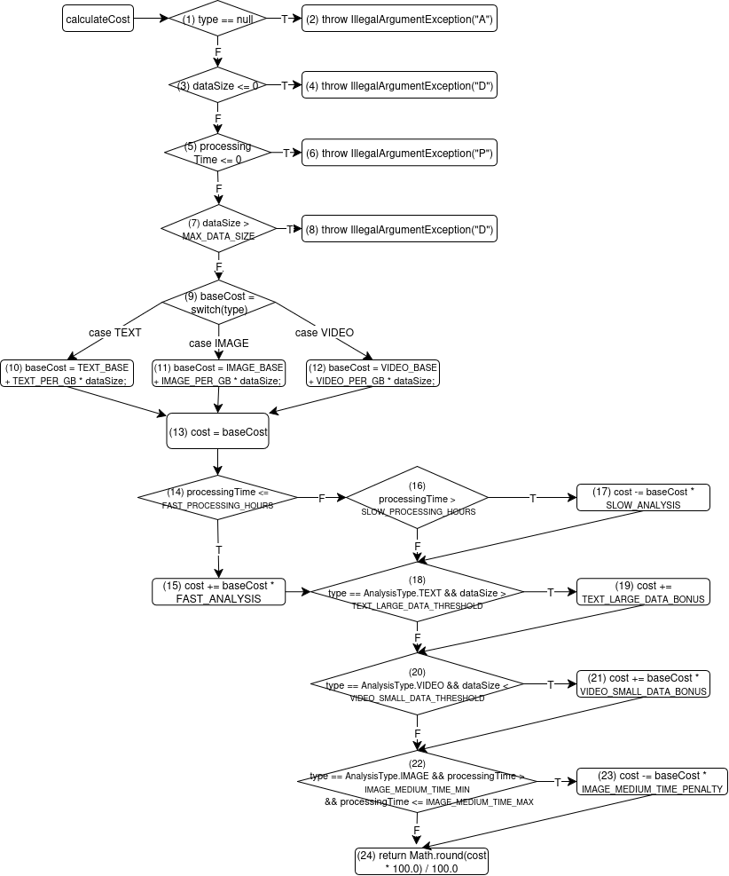

# Kiểm thử luồng dữ liệu với độ đo All-Uses

## Phân tích luồng dữ liệu
- **Biến đầu vào**:
    - `type`: Được sử dụng trong kiểm tra `type == null` và switch expression.
    - `dataSize`: Được sử dụng trong kiểm tra điều kiện và tính toán chi phí.
    - `processingTime`: Được sử dụng trong kiểm tra điều kiện và điều chỉnh chi phí.
- **Biến cục bộ**:
    - `baseCost`: Được gán trong switch expression và sử dụng trong các điều chỉnh chi phí.
    - `cost`: Được gán từ `baseCost` và cập nhật qua các quy tắc đặc biệt, cuối cùng trả về.

### Control Flow Graph (CFG)

### Các biến và def-use pairs
Dựa trên code, mình xác định các biến và các cặp def-use:

| Biến             | def                    | p - use          | c-use                  |
|------------------|------------------------|------------------|------------------------|
| `type`           | 0                      | 1, 9, 18, 20, 22 |                        |
| `dataSize`       | 0                      | 3, 7, 18, 20     | 10, 11, 12             |
| `processingTime` | 0                      | 5, 14, 16, 22    |                        |
| `baseCost`       | 9, 10, 11, 12          |                  | 13, 15, 17, 21, 23     |
| `cost`           | 13, 15, 17, 19, 21, 23 |                  | 15, 17, 19, 21, 23, 24 |

### Danh sách các cặp def-use

| Variable       | DU-Pairs       | Def-Clear Path                                                                               | Complete Path                                                                                             | Test Case                              |
|----------------|----------------|----------------------------------------------------------------------------------------------|-----------------------------------------------------------------------------------------------------------|----------------------------------------|
| type           | 0 - 1(T)       | 0 → 1(T)                                                                                     | 0 → 1(T) → 2                                                                                              | `calculateCost(null, 0.00, 0)`         |
| type           | 0 - 1(F)       | 0 → 1(F)                                                                                     | 0 → 1(F) → 3(F) → 5(F) → 7(F) → 9(TEXT) → 10 → 13 → 14(T) → 15 → 18(T) → 19 → 20(F) → 22(F) → 24          | `calculateCost(TEXT, 60.00, 1)`        |
| type           | 0 - 9(TEXT)    | 0 → 1(F) → 3(F) → 5(F) → 7(F) → 9(TEXT)                                                      | 0 → 1(F) → 3(F) → 5(F) → 7(F) → 9(TEXT) → 10 → 13 → 14(T) → 15 → 18(T) → 19 → 20(F) → 22(F) → 24          | `calculateCost(TEXT, 60.00, 1)`        |
| type           | 0 - 9(IMAGE)   | 0 → 1(F) → 3(F) → 5(F) → 7(F) → 9(IMAGE)                                                     | 0 → 1(F) → 3(F) → 5(F) → 7(F) → 9(IMAGE) → 11 → 13 → 14(F) → 16(F) → 18(F) → 20(F) → 22(T) → 23 → 24      | `calculateCost(IMAGE, 60.00, 5)`       |
| type           | 0 - 9(VIDEO)   | 0 → 1(F) → 3(F) → 5(F) → 7(F) → 9(VIDEO)                                                     | 0 → 1(F) → 3(F) → 5(F) → 7(F) → 9(VIDEO) → 12 → 13 → 14(T) → 15 → 18(F) → 20(T) → 21 → 22(F) → 24         | `calculateCost(VIDEO, 9.00, 2)`        |
| dataSize       | 0 - 3(T)       | 0 → 1(F) → 3(T)                                                                              | 0 → 1(F) → 3(T) → 4                                                                                       | `calculateCost(TEXT, 0.00, 8)`         |
| dataSize       | 0 - 3(F)       | 0 → 1(F) → 3(F)                                                                              | 0 → 1(F) → 3(F) → 5(F) → 7(F) → 9(TEXT) → 10 → 13 → 14(T) → 15 → 18(T) → 19 → 20(F) → 22(F) → 24          | `calculateCost(TEXT, 60.00, 1)`        |
| dataSize       | 0 - 7(T)       | 0 → 1(F) → 3(F) → 5(F) → 7(T)                                                                | 0 → 1(F) → 3(F) → 5(F) → 7(T) → 8                                                                         | `calculateCost(TEXT, 1000001.00, 2)`   |
| dataSize       | 0 - 7(F)       | 0 → 1(F) → 3(F) → 5(F) → 7(F)                                                                | 0 → 1(F) → 3(F) → 5(F) → 7(F) → 9(TEXT) → 10 → 13 → 14(T) → 15 → 18(T) → 19 → 20(F) → 22(F) → 24          | `calculateCost(TEXT, 60.00, 1)`        |
| dataSize       | 0 - 10         | 0 → 1(F) → 3(F) → 5(F) → 7(F) → 9(TEXT) → 10                                                 | 0 → 1(F) → 3(F) → 5(F) → 7(F) → 9(TEXT) → 10 → 13 → 14(T) → 15 → 18(T) → 19 → 20(F) → 22(F) → 24          | `calculateCost(TEXT, 60.00, 1)`        |
| dataSize       | 0 - 11         | 0 → 1(F) → 3(F) → 5(F) → 7(F) → 9(IMAGE) → 11                                                | 0 → 1(F) → 3(F) → 5(F) → 7(F) → 9(IMAGE) → 11 → 13 → 14(F) → 16(F) → 18(F) → 20(F) → 22(T) → 23 → 24      | `calculateCost(IMAGE, 60.00, 5)`       |
| dataSize       | 0 - 12         | 0 → 1(F) → 3(F) → 5(F) → 7(F) → 9(VIDEO) → 12                                                | 0 → 1(F) → 3(F) → 5(F) → 7(F) → 9(VIDEO) → 12 → 13 → 14(T) → 15 → 18(F) → 20(T) → 21 → 22(F) → 24         | `calculateCost(VIDEO, 9.00, 2)`        |
| dataSize       | 0 - 18(T)      | 0 → 1(F) → 3(F) → 5(F) → 7(F) → 9(TEXT) → 10 → 13 → 14(T) → 15 → 18(T)                       | 0 → 1(F) → 3(F) → 5(F) → 7(F) → 9(TEXT) → 10 → 13 → 14(T) → 15 → 18(T) → 19 → 20(F) → 22(F) → 24          | `calculateCost(TEXT, 60.00, 1)`        |
| dataSize       | 0 - 18(F)      | 0 → 1(F) → 3(F) → 5(F) → 7(F) → 9(TEXT) → 10 → 13 → 14(T) → 15 → 18(F)                       | 0 → 1(F) → 3(F) → 5(F) → 7(F) → 9(TEXT) → 10 → 13 → 14(T) → 15 → 18(F) → 20(F) → 22(F) → 24               | `calculateCost(TEXT, 40.00, 1)`        |
| dataSize       | 0 - 20(T)      | 0 → 1(F) → 3(F) → 5(F) → 7(F) → 9(VIDEO) → 12 → 13 → 14(T) → 15 → 18(F) → 20(T)              | 0 → 1(F) → 3(F) → 5(F) → 7(F) → 9(VIDEO) → 12 → 13 → 14(T) → 15 → 18(F) → 20(T) → 21 → 22(F) → 24         | `calculateCost(VIDEO, 9.00, 2)`        |
| dataSize       | 0 - 20(F)      | 0 → 1(F) → 3(F) → 5(F) → 7(F) → 9(TEXT) → 10 → 13 → 14(T) → 15 → 18(T) → 19 → 20(F)          | 0 → 1(F) → 3(F) → 5(F) → 7(F) → 9(TEXT) → 10 → 13 → 14(T) → 15 → 18(T) → 19 → 20(F) → 22(F) → 24          | `calculateCost(TEXT, 60.00, 1)`        |
| processingTime | 0 - 5(T)       | 0 → 1(F) → 3(F) → 5(T)                                                                       | 0 → 1(F) → 3(F) → 5(T) → 6                                                                                | `calculateCost(TEXT, 10.00, 0)`        |
| processingTime | 0 - 5(F)       | 0 → 1(F) → 3(F) → 5(F)                                                                       | 0 → 1(F) → 3(F) → 5(F) → 7(F) → 9(TEXT) → 10 → 13 → 14(T) → 15 → 18(T) → 19 → 20(F) → 22(F) → 24          | `calculateCost(TEXT, 60.00, 1)`        |
| processingTime | 0 - 14(T)      | 0 → 1(F) → 3(F) → 5(F) → 7(F) → 9(TEXT) → 10 → 13 → 14(T)                                    | 0 → 1(F) → 3(F) → 5(F) → 7(F) → 9(TEXT) → 10 → 13 → 14(T) → 15 → 18(T) → 19 → 20(F) → 22(F) → 24          | `calculateCost(TEXT, 60.00, 1)`        |
| processingTime | 0 - 14(F)      | 0 → 1(F) → 3(F) → 5(F) → 7(F) → 9(IMAGE) → 11 → 13 → 14(F)                                   | 0 → 1(F) → 3(F) → 5(F) → 7(F) → 9(IMAGE) → 11 → 13 → 14(F) → 16(F) → 18(F) → 20(F) → 22(T) → 23 → 24      | `calculateCost(IMAGE, 60.00, 5)`       |
| processingTime | 0 - 16(T)      | 0 → 1(F) → 3(F) → 5(F) → 7(F) → 9(IMAGE) → 11 → 13 → 14(F) → 16(T) → 17 → 18(F) → 20(F)      | 0 → 1(F) → 3(F) → 5(F) → 7(F) → 9(IMAGE) → 11 → 13 → 14(F) → 16(T) → 17 → 18(F) → 20(F) → 22(T) → 23 → 24 | `calculateCost(IMAGE, 60.00, 10)`      |
| processingTime | 0 - 16(F)      | 0 → 1(F) → 3(F) → 5(F) → 7(F) → 9(IMAGE) → 11 → 13 → 14(F) → 16(F)                           | 0 → 1(F) → 3(F) → 5(F) → 7(F) → 9(IMAGE) → 11 → 13 → 14(F) → 16(F) → 18(F) → 20(F) → 22(T) → 23 → 24      | `calculateCost(IMAGE, 60.00, 5)`       |
| processingTime | 0 - 22(T)      | 0 → 1(F) → 3(F) → 5(F) → 7(F) → 9(IMAGE) → 11 → 13 → 14(F) → 16(F) → 18(F) → 20(F) → 22(T)   | 0 → 1(F) → 3(F) → 5(F) → 7(F) → 9(IMAGE) → 11 → 13 → 14(F) → 16(F) → 18(F) → 20(F) → 22(T) → 23 → 24      | `calculateCost(IMAGE, 60.00, 5)`       |
| processingTime | 0 - 22(F)      | 0 → 1(F) → 3(F) → 5(F) → 7(F) → 9(VIDEO) → 12 → 13 → 14(T) → 15 → 18(F) → 20(T) → 21 → 22(F) | 0 → 1(F) → 3(F) → 5(F) → 7(F) → 9(VIDEO) → 12 → 13 → 14(T) → 15 → 18(F) → 20(T) → 21 → 22(F) → 24         | `calculateCost(VIDEO, 9.00, 2)`        |
| baseCost       | 9 - 13         | 9 → 10 → 13                                                                                  | 0 → 1(F) → 3(F) → 5(F) → 7(F) → 9(TEXT) → 10 → 13 → 14(T) → 15 → 18(T) → 19 → 20(F) → 22(F) → 24          | `calculateCost(TEXT, 60.00, 1)`        |
| baseCost       | 9 - 15         | 9 → 10 → 13 → 14(T) → 15                                                                     | 0 → 1(F) → 3(F) → 5(F) → 7(F) → 9(TEXT) → 10 → 13 → 14(T) → 15 → 18(T) → 19 → 20(F) → 22(F) → 24          | `calculateCost(TEXT, 60.00, 1)`        |
| baseCost       | 9 - 17         | 9 → 10 → 13 → 14(F) → 16(T) → 17                                                             | 0 → 1(F) → 3(F) → 5(F) → 7(F) → 9(IMAGE) → 11 → 13 → 14(F) → 16(T) → 17 → 18(F) → 20(F) → 22(T) → 23 → 24 | `calculateCost(IMAGE, 60.00, 10)`      |
| baseCost       | 9 - 21         | 9 → 12 → 13 → 14(T) → 15 → 18(F) → 20(T) → 21                                                | 0 → 1(F) → 3(F) → 5(F) → 7(F) → 9(VIDEO) → 12 → 13 → 14(T) → 15 → 18(F) → 20(T) → 21 → 22(F) → 24         | `calculateCost(VIDEO, 9.00, 2)`        |
| baseCost       | 9 - 23         | 9 → 11 → 13 → 14(F) → 16(F) → 18(F) → 20(F) → 22(T) → 23                                     | 0 → 1(F) → 3(F) → 5(F) → 7(F) → 9(IMAGE) → 11 → 13 → 14(F) → 16(F) → 18(F) → 20(F) → 22(T) → 23 → 24      | `calculateCost(IMAGE, 60.00, 5)`       |
| baseCost       | 10 - 13        | 10 → 13                                                                                      | 0 → 1(F) → 3(F) → 5(F) → 7(F) → 9(TEXT) → 10 → 13 → 14(T) → 15 → 18(T) → 19 → 20(F) → 22(F) → 24          | `calculateCost(TEXT, 60.00, 1)`        |
| baseCost       | 10 - 15        | 10 → 13 → 14(T) → 15                                                                         | 0 → 1(F) → 3(F) → 5(F) → 7(F) → 9(TEXT) → 10 → 13 → 14(T) → 15 → 18(T) → 19 → 20(F) → 22(F) → 24          | `calculateCost(TEXT, 60.00, 1)`        |
| baseCost       | 10 - 17        | 10 → 13 → 14(F) → 16(T) → 17                                                                 | 0 → 1(F) → 3(F) → 5(F) → 7(F) → 9(TEXT) → 10 → 13 → 14(F) → 16(T) → 17 → 18(F) → 20(F) → 22(F) → 24       | `calculateCost(TEXT, 40.00, 10)`       |
| baseCost       | 10 - 21        | ---                                                                                          | ---                                                                                                       | ---                                    |
| baseCost       | 10 - 23        | ---                                                                                          | ---                                                                                                       | ---                                    |
| baseCost       | 11 - 13        | 11 → 13                                                                                      | 0 → 1(F) → 3(F) → 5(F) → 7(F) → 9(IMAGE) → 11 → 13 → 14(F) → 16(F) → 18(F) → 20(F) → 22(T) → 23 → 24      | `calculateCost(IMAGE, 60.00, 5)`       |
| baseCost       | 11 - 15        | 11 → 13 → 14(T) → 15                                                                         | 0 → 1(F) → 3(F) → 5(F) → 7(F) → 9(IMAGE) → 11 → 13 → 14(T) → 15 → 18(F) → 20(F) → 22(F) → 24              | `calculateCost(IMAGE, 60.00, 2)`       |
| baseCost       | 11 - 17        | 11 → 13 → 14(F) → 16(T) → 17                                                                 | 0 → 1(F) → 3(F) → 5(F) → 7(F) → 9(IMAGE) → 11 → 13 → 14(F) → 16(T) → 17 → 18(F) → 20(F) → 22(T) → 23 → 24 | `calculateCost(IMAGE, 60.00, 10)`      |
| baseCost       | 11 - 21        | ---                                                                                          | ---                                                                                                       | ---                                    |
| baseCost       | 11 - 23        | 11 → 13 → 14(F) → 16(F) → 18(F) → 20(F) → 22(T) → 23                                         | 0 → 1(F) → 3(F) → 5(F) → 7(F) → 9(IMAGE) → 11 → 13 → 14(F) → 16(F) → 18(F) → 20(F) → 22(T) → 23 → 24      | `calculateCost(IMAGE, 60.00, 5)`       |
| baseCost       | 12 - 13        | 12 → 13                                                                                      | 0 → 1(F) → 3(F) → 5(F) → 7(F) → 9(VIDEO) → 12 → 13 → 14(T) → 15 → 18(F) → 20(T) → 21 → 22(F) → 24         | `calculateCost(VIDEO, 9.00, 2)`        |
| baseCost       | 12 - 15        | 12 → 13 → 14(T) → 15                                                                         | 0 → 1(F) → 3(F) → 5(F) → 7(F) → 9(VIDEO) → 12 → 13 → 14(T) → 15 → 18(F) → 20(T) → 21 → 22(F) → 24         | `calculateCost(VIDEO, 9.00, 2)`        |
| baseCost       | 12 - 17        | 12 → 13 → 14(F) → 16(T) → 17                                                                 | 0 → 1(F) → 3(F) → 5(F) → 7(F) → 9(VIDEO) → 12 → 13 → 14(F) → 16(T) → 17 → 18(F) → 20(T) → 21 → 22(F) → 24 | `calculateCost(VIDEO, 9.00, 10)`       |
| baseCost       | 12 - 21        | 12 → 13 → 14(T) → 15 → 18(F) → 20(T) → 21                                                    | 0 → 1(F) → 3(F) → 5(F) → 7(F) → 9(VIDEO) → 12 → 13 → 14(T) → 15 → 18(F) → 20(T) → 21 → 22(F) → 24         | `calculateCost(VIDEO, 9.00, 2)`        |
| baseCost       | 12 - 23        | ---                                                                                          | ---                                                                                                       | ---                                    |
| cost           | 13 - 15        | 13 → 14(F) → 16(F) → 18(F) → 20(F) → 22(T) → 23 → 24                                         | 0 → 1(F) → 3(F) → 5(F) → 7(F) → 9(IMAGE) → 11 → 13 → 14(F) → 16(F) → 18(F) → 20(F) → 22(T) → 23 → 24      | `calculateCost(IMAGE, 60.00, 5)`       |
| cost           | 13 - 17        | 13 → 14(F) → 16(T) → 17                                                                      | 0 → 1(F) → 3(F) → 5(F) → 7(F) → 9(VIDEO) → 12 → 13 → 14(F) → 16(T) → 17 → 18(F) → 20(T) → 21 → 22(F) → 24 | `calculateCost(VIDEO, 9.00, 10)`       |
| cost           | 13 - 19        | 13 → 14(T) → 15 → 18(T) → 19                                                                 | 0 → 1(F) → 3(F) → 5(F) → 7(F) → 9(TEXT) → 10 → 13 → 14(T) → 15 → 18(T) → 19 → 20(F) → 22(F) → 24          | `calculateCost(TEXT, 60.00, 1)`        |
| cost           | 13 - 21        | 13 → 14(F) → 16(T) → 17 → 18(F) → 20(T) → 21                                                 | 0 → 1(F) → 3(F) → 5(F) → 7(F) → 9(VIDEO) → 12 → 13 → 14(F) → 16(T) → 17 → 18(F) → 20(T) → 21 → 22(F) → 24 | `calculateCost(VIDEO, 9.00, 10)`       |
| cost           | 13 - 23        | ---                                                                                          | ---                                                                                                       | ---                                    |
| cost           | 13 - 24        | 13 → 14(F) → 16(F) → 18(F) → 20(F) → 22(T) → 23 → 24                                         | 0 → 1(F) → 3(F) → 5(F) → 7(F) → 9(IMAGE) → 11 → 13 → 14(F) → 16(F) → 18(F) → 20(F) → 22(T) → 23 → 24      | `calculateCost(IMAGE, 60.00, 5)`       |
| cost           | 15 - 15        | ---                                                                                          | ---                                                                                                       | ---                                    |
| cost           | 15 - 17        | ---                                                                                          | ---                                                                                                       | ---                                    |
| cost           | 15 - 19        | 15 → 18(T) → 19                                                                              | 0 → 1(F) → 3(F) → 5(F) → 7(F) → 9(TEXT) → 10 → 13 → 14(T) → 15 → 18(T) → 19 → 20(F) → 22(F) → 24          | `calculateCost(TEXT, 60.00, 1)`        |
| cost           | 15 - 21        | 15 → 18(F) → 20(T) → 21                                                                      | 0 → 1(F) → 3(F) → 5(F) → 7(F) → 9(VIDEO) → 12 → 13 → 14(T) → 15 → 18(F) → 20(T) → 21 → 22(F) → 24         | `calculateCost(VIDEO, 9.00, 2)`        |
| cost           | 15 - 23        | ---                                                                                          | ---                                                                                                       | ---                                    |
| cost           | 15 - 24        | 15 → 18(T) → 19 → 20(F) → 22(F) → 24                                                         | 0 → 1(F) → 3(F) → 5(F) → 7(F) → 9(TEXT) → 10 → 13 → 14(T) → 15 → 18(T) → 19 → 20(F) → 22(F) → 24          | `calculateCost(TEXT, 60.00, 1)`        |
| cost           | 17 - 15        | ---                                                                                          | ---                                                                                                       | ---                                    |
| cost           | 17 - 17        | ---                                                                                          | ---                                                                                                       | ---                                    |
| cost           | 17 - 19        | 17 → 18(T) → 19                                                                              | 0 → 1(F) → 3(F) → 5(F) → 7(F) → 9(TEXT) → 10 → 13 → 14(F) → 16(T) → 17 → 18(T) → 19 → 20(F) → 22(F) → 24  | `calculateCost(TEXT, 60.00, 4)`        |
| cost           | 17 - 21        | 17 → 18(F) → 20(T) → 21                                                                      | 0 → 1(F) → 3(F) → 5(F) → 7(F) → 9(VIDEO) → 12 → 13 → 14(F) → 16(T) → 17 → 18(F) → 20(T) → 21 → 22(F) → 24 | `calculateCost(VIDEO, 9.00, 10)`       |
| cost           | 17 - 23        | 17 → 18(F) → 20(F) → 22(T) → 23                                                              | 0 → 1(F) → 3(F) → 5(F) → 7(F) → 9(IMAGE) → 11 → 13 → 14(F) → 16(T) → 17 → 18(F) → 20(F) → 22(T) → 23 → 24 | `calculateCost(IMAGE, 60.00, 10)`      |
| cost           | 17 - 24        | 17 → 18(F) → 20(T) → 21 → 22(F) → 24                                                         | 0 → 1(F) → 3(F) → 5(F) → 7(F) → 9(VIDEO) → 12 → 13 → 14(F) → 16(T) → 17 → 18(F) → 20(T) → 21 → 22(F) → 24 | `calculateCost(VIDEO, 9.00, 10)`       |
| cost           | 19 - 15        | ---                                                                                          | ---                                                                                                       | ---                                    |
| cost           | 19 - 17        | ---                                                                                          | ---                                                                                                       | ---                                    |
| cost           | 19 - 19        | ---                                                                                          | ---                                                                                                       | ---                                    |
| cost           | 19 - 21        | ---                                                                                          | ---                                                                                                       | ---                                    |
| cost           | 19 - 23        | ---                                                                                          | ---                                                                                                       | ---                                    |
| cost           | 19 - 24        | 19 → 20(F) → 22(F) → 24                                                                      | 0 → 1(F) → 3(F) → 5(F) → 7(F) → 9(TEXT) → 10 → 13 → 14(T) → 15 → 18(T) → 19 → 20(F) → 22(F) → 24          | `calculateCost(TEXT, 60.00, 1)`        |
| cost           | 21 - 15        | ---                                                                                          | ---                                                                                                       | ---                                    |
| cost           | 21 - 17        | ---                                                                                          | ---                                                                                                       | ---                                    |
| cost           | 21 - 19        | ---                                                                                          | ---                                                                                                       | ---                                    |
| cost           | 21 - 21        | ---                                                                                          | ---                                                                                                       | ---                                    |
| cost           | 21 - 23        | ---                                                                                          | ---                                                                                                       | ---                                    |
| cost           | 21 - 24        | 21 → 22(F) → 24                                                                              | 0 → 1(F) → 3(F) → 5(F) → 7(F) → 9(VIDEO) → 12 → 13 → 14(F) → 16(T) → 17 → 18(F) → 20(T) → 21 → 22(F) → 24 | `calculateCost(VIDEO, 9.00, 10)`       |
| cost           | 23 - 15        | ---                                                                                          | ---                                                                                                       | ---                                    |
| cost           | 23 - 17        | ---                                                                                          | ---                                                                                                       | ---                                    |
| cost           | 23 - 19        | ---                                                                                          | ---                                                                                                       | ---                                    |
| cost           | 23 - 21        | ---                                                                                          | ---                                                                                                       | ---                                    |
| cost           | 23 - 23        | ---                                                                                          | ---                                                                                                       | ---                                    |
| cost           | 23 - 24        | 23 → 24                                                                                      | 0 → 1(F) → 3(F) → 5(F) → 7(F) → 9(IMAGE) → 11 → 13 → 14(F) → 16(F) → 18(F) → 20(F) → 22(T) → 23 → 24      | `calculateCost(IMAGE, 60.00, 5)`       |

## Test case và report
| Id   | analysisType | dataSize     | processingTime | Expected Output             | Actual Output               | Result |
|------|--------------|--------------|----------------|-----------------------------|-----------------------------|--------|
| AU01 | null         | 0.00         | 0              | IllegalArgumentException    | IllegalArgumentException    | Passed |
| AU02 | TEXT         | 60.00        | 1              | 484.00                      | 484.00                      | Passed |
| AU03 | IMAGE        | 60.00        | 5              | 585.00                      | 585.00                      | Passed |
| AU04 | VIDEO        | 9.00         | 2              | 329.00                      | 329.00                      | Passed |
| AU05 | TEXT         | 0.00         | 8              | IllegalArgumentException    | IllegalArgumentException    | Passed |
| AU06 | TEXT         | 1000001.00   | 2              | IllegalArgumentException    | IllegalArgumentException    | Passed |
| AU07 | TEXT         | 40.00        | 1              | 264.00                      | 264.00                      | Passed |
| AU08 | TEXT         | 10.00        | 0              | IllegalArgumentException    | IllegalArgumentException    | Passed |
| AU09 | IMAGE        | 60.00        | 10             | 552.50                      | 552.50                      | Passed |
| AU10 | TEXT         | 40.00        | 10             | 187.00                      | 187.00                      | Passed |
| AU11 | IMAGE        | 60.00        | 2              | 780.00                      | 780.00                      | Passed |
| AU12 | VIDEO        | 9.00         | 10             | 246.75                      | 246.75                      | Passed |
| AU13 | TEXT         | 60.00        | 4              | 420.00                      | 420.00                      | Passed |