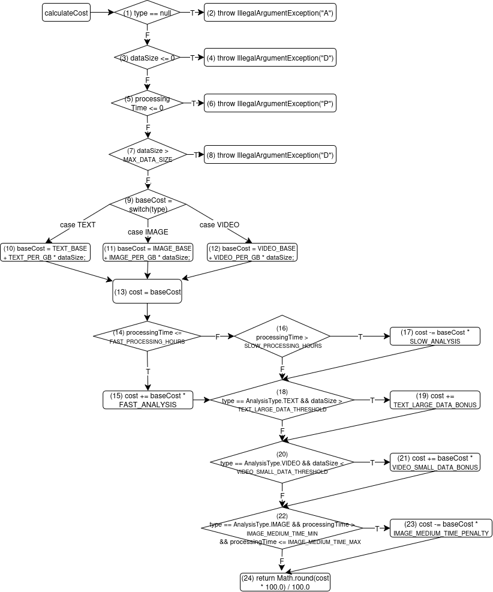

# Kiểm thử dòng điều khiển

## Control Flow Graph (CFG)

CFG của hàm `calculateCost` bao gồm 24 nút (0–24), đại diện cho các khối lệnh cơ bản và các kiểm tra điều kiện:

- **Nút 0**: Điểm vào (entry).
- **Nút 1**: Kiểm tra `type != null`.
- **Nút 2**: Ném `IllegalArgumentException` (nếu `type == null`).
- **Nút 3**: Kiểm tra `dataSize > 0`.
- **Nút 4**: Ném `IllegalArgumentException` (nếu `dataSize <= 0`).
- **Nút 5**: Kiểm tra `processingTime > 0`.
- **Nút 6**: Ném `IllegalArgumentException` (nếu `processingTime <= 0`).
- **Nút 7**: Kiểm tra `dataSize <= 1,000,000.00`.
- **Nút 8**: Ném `IllegalArgumentException` (nếu `dataSize > 1,000,000.00`).
- **Nút 9**: Switch trên `type` (TEXT, IMAGE, VIDEO).
- **Nút 10**: Tính chi phí cơ bản cho TEXT.
- **Nút 11**: Tính chi phí cơ bản cho IMAGE.
- **Nút 12**: Tính chi phí cơ bản cho VIDEO.
- **Nút 13**: Khởi tạo chi phí cost
- **Nút 14–17**: Kiểm tra và điều chỉnh chi phí theo `processingTime`.
- **Nút 18–19**: Kiểm tra và áp dụng quy tắc đặc biệt cho TEXT.
- **Nút 20–21**: Kiểm tra và áp dụng quy tắc đặc biệt cho VIDEO.
- **Nút 22–23**: Kiểm tra và áp dụng quy tắc đặc biệt cho IMAGE.
- **Nút 24**: Trả về chi phí cuối cùng (exit).

## Các đường đi và test case với độ đo kiểm thử C2 (Branch Coverage Criterion)

Dưới đây là 9 đường đi độc lập và các test case tương ứng để đạt Path Coverage (C2):

| Path   | Test Case                               | Path                                                                                                 | Note                                                                               |
|--------|-----------------------------------------|------------------------------------------------------------------------------------------------------|------------------------------------------------------------------------------------|
| Path 1 | `calculateCost(null, 12.50, 8)`         | 0 → 1(T) → 2                                                                                         | Kiểm tra `type = null`                                                             |
| Path 2 | `calculateCost(TEXT, -2.00, 8)`         | 0 → 1(F) → 3(T) → 4                                                                                  | Kiểm tra `dataSize < 0`                                                            |
| Path 3 | `calculateCost(TEXT, 8.00, 0)`          | 0 → 1(F) → 3(F) → 5(T) → 6                                                                           | Kiểm tra `processingTime = 0`                                                      |
| Path 4 | `calculateCost(TEXT, 1_000_001.50, 10)` | 0 → 1(F) → 3(F) → 5(F) → 7(T) → 8                                                                    | Kiểm tra `dataSize > 1,000,000`                                                    |
| Path 5 | `calculateCost(TEXT, 100.00, 1)`        | 0 → 1(F) → 3(F) → 5(F) → 7(F) → 9(TEXT) → 10 → 13 → 14(T) → 15 → 18(T) → 19 → 20(F) → 22(F) → 24     | `TEXT`, `dataSize > 50`, `processingTime ≤ 2` (tăng 20%, cộng $100)                |
| Path 6 | `calculateCost(TEXT, 40.00, 8)`         | 0 → 1(F) → 3(F) → 5(F) → 7(F) → 9(TEXT) → 10 → 13 → 14(F) → 16(T) → 17 → 18(F) → 20(F) → 22(F) → 24  | `TEXT`, `dataSize ≤ 50`, `processingTime > 6` (giảm 15%)                           |
| Path 7 | `calculateCost(TEXT, 40.00, 4)`         | 0 → 1(F) → 3(F) → 5(F) → 7(F) → 9(TEXT) → 10 → 13 → 14(F) → 16(F) → 18(F) → 20(F) → 22(F) → 24       | `TEXT`, `dataSize ≤ 50`, `2 < processingTime ≤ 6` (không đổi)                      |
| Path 8 | `calculateCost(IMAGE, 100.00, 5)`       | 0 → 1(F) → 3(F) → 5(F) → 7(F) → 9(IMAGE) → 11 → 13 → 14(F) → 16(F) → 18(F) → 20(F) → 22(T) → 23 → 24 | `IMAGE`, `processingTime > 4` (giảm 10%)                                           |
| Path 9 | `calculateCost(VIDEO, 9.00, 1)`         | 0 → 1(F) → 3(F) → 5(F) → 7(F) → 9(VIDEO) → 12 → 13 → 14(T) → 15 → 18(F) → 20(T) → 21 → 22(F) → 24    | `VIDEO`, `dataSize < 10`, `processingTime ≤ 2` tăng 20% cơ bản, tăng 20% đặc biệt) |

## Test report
| Id         | analysisType | dataSize     | processingTime | Expected Output          | Actual Output            | Result |
|------------|--------------|--------------|----------------|--------------------------|--------------------------|--------|
| CF-C2-TC1  | null         | 12.50        | 8              | IllegalArgumentException | IllegalArgumentException | Passed |
| CF-C2-TC2  | TEXT         | -2.00        | 8              | IllegalArgumentException | IllegalArgumentException | Passed |
| CF-C2-TC3  | TEXT         | 8.00         | 0              | IllegalArgumentException | IllegalArgumentException | Passed |
| CF-C2-TC4  | TEXT         | 1,000,001.50 | 10             | IllegalArgumentException | IllegalArgumentException | Passed |
| CF-C2-TC5  | TEXT         | 100.00       | 1              | 724.00                   | 724.00                   | Passed |
| CF-C2-TC6  | TEXT         | 40.00        | 8              | 187.00                   | 187.00                   | Passed |
| CF-C2-TC7  | TEXT         | 40.00        | 4              | 220.00                   | 220.00                   | Passed |
| CF-C2-TC8  | IMAGE        | 100.00       | 5              | 945.00                   | 945.00                   | Passed |
| CF-C2-TC9  | VIDEO        | 9.00         | 1              | 329.00                   | 329.00                   | Passed |

## Kết luận
- **Path Coverage (C2)**: 9 test case trên bao phủ 100% các đường đi độc lập trong CFG của hàm `calculateCost`.
- **Lợi ích**: Đảm bảo kiểm tra tất cả các nhánh logic, bao gồm các trường hợp lỗi và các quy tắc đặc biệt.
